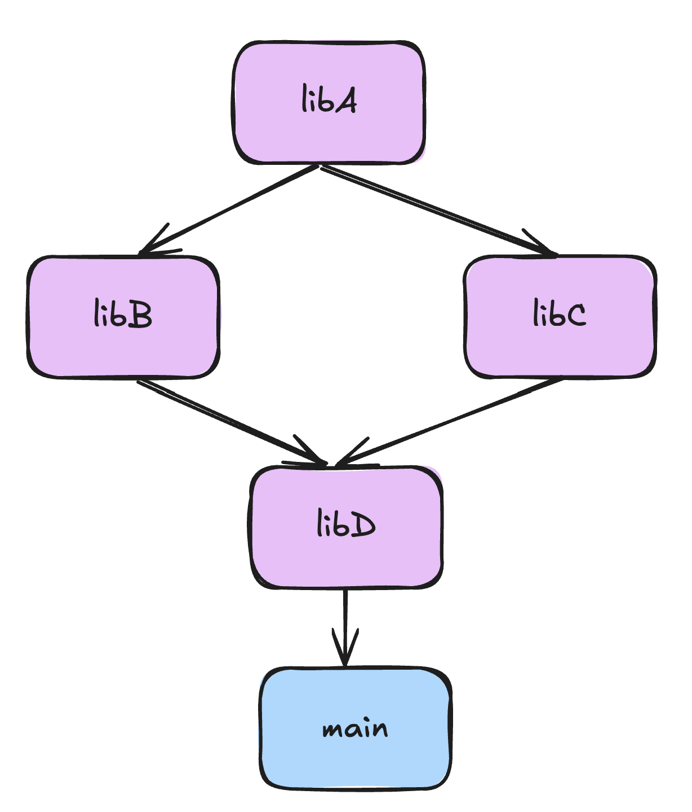

Структура проекта

Зависимости библиотек

libA.hpp
```c++
#pragma once
void doSomeThingA();
```
libA.cpp
```c++
#include "../include/libA.hpp"
#include <iostream>

void doSomeThingA(){
	std::cout << "start doSomeThingA" << std::endl;
	std::cout << "end doSomeThingA" << std::endl;
}
```
libA/CMakeLists.txt
```bash
cmake_minimum_required(VERSION 3.15)
project(libA)


add_library(libA STATIC src/libA.cpp)

target_include_directories(libA PUBLIC include)
```
libB.hpp
```c++
#pragma once
void doSomeThingB();
```
libB.cpp
```c++
#include "../include/libB.hpp"
#include <iostream>
#include "../../libA/include/libA.hpp"

void doSomeThingB(){

	std::cout << "start doSomeThingB" << std::endl;
	doSomeThingA();
	std::cout << "end doSomeThingB" << std::endl;
}
```
libB/CMakeLists.txt
```bash
cmake_minimum_required(VERSION 3.15)
project(libB)

add_library(libB STATIC src/libB.cpp)

target_include_directories(libB PUBLIC include)

target_link_libraries(libB PRIVATE libA)
```
libC.hpp
```c++
#pragma once
void doSomeThingC();
```
libC.cpp
```c++
#include "../include/libC.hpp"
#include <iostream>
#include "../../libA/include/libA.hpp"

void doSomeThingC(){

	std::cout << "start doSomeThingC" << std::endl;

	doSomeThingA();

	std::cout << "end doSomeThingC" << std::endl;
}
```
libC/CMakeLists.txt
```bash
cmake_minimum_required(VERSION 3.15)

project(libC)

add_library(libC STATIC src/libC.cpp)

target_include_directories(libC PUBLIC include)

target_link_libraries(libC PRIVATE libA)
```
libD.hpp
```c++
#pragma once
void doSomeThingD();
```
libD.cpp
```c++
#include "../include/libD.hpp"
#include <iostream>
#include "../../libB/include/libB.hpp"
#include "../../libC/include/libC.hpp"

void doSomeThingD(){

	std::cout << "start doSomeThingD" << std::endl;

	doSomeThingB();

	doSomeThingC();

	std::cout << "end doSomeThingD" << std::endl;
}
```
libD/CMakeLists.txt
```bash
cmake_minimum_required(VERSION 3.15)

project(libD)

add_library(libD STATIC src/libD.cpp)

target_include_directories(libD INTERFACE include)

target_link_libraries(libD PRIVATE libB libC)
```
CMakeLists.txt
```bash
cmake_minimum_required(VERSION 3.15)

project(MyProject)

add_subdirectory(libA)

add_subdirectory(libB)

add_subdirectory(libC)

add_subdirectory(libD)

add_subdirectory(app)
```

В данном случае запуск исполняемого файла будет в **build/app/main**
Чтобы собрать проект заходим в build и вводим команды
```bash
cd build
cmake ..
make

./app/main
```
- [cmake_minimum_required](cmake_minimum_required.md)
- [project](project.md)
- [set](set.md)
- [add_library](add_library.md)
- [target_include_directories](target_include_directories.md)
- [include_directories](include_directories.md)
- [add_executable](add_executable.md)
- [target_link_libraries](target_link_libraries.md)
- [add_subdirectory](add_subdirectory.md)
