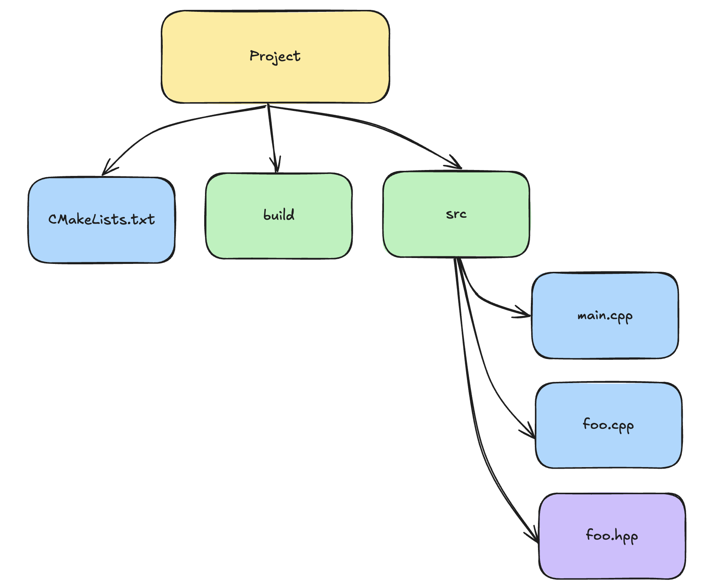

Структура проекта:

main.cpp
```c++
#include "foo.hpp"
#include <iostream>
  
int main(){
	print();
	return 0;
}
```
foo.hpp
```c++
#pragma once
void print();
```
foo.cpp
```c++
#include "foo.hpp"
#include <iostream>

void print(){
	std::cout << "Hello, world!!!" << std::endl;
}
```
CMakeLists.txt
```bash
cmake_minimum_required(VERSION 3.30)

project(hello_world)

set(SOURCE_EXE src/main.cpp)
  
set(SOURCE_LIB src/foo.cpp)
  

add_library(foo STATIC ${SOURCE_LIB})

  

target_include_directories(foo PUBLIC src)

add_executable(main ${SOURCE_EXE}) 
  
target_link_libraries(main foo)
```
Функции:
- [cmake_minimum_required](cmake_minimum_required.md)
- [project](project.md)
- [set](set.md)
- [add_executable](add_executable.md)
- [add_library](add_library.md)
- [target_include_directories](target_include_directories.md)
- [target_link_libraries](target_link_libraries.md)
В данном примере foo.hpp находится в поддиректории src.
