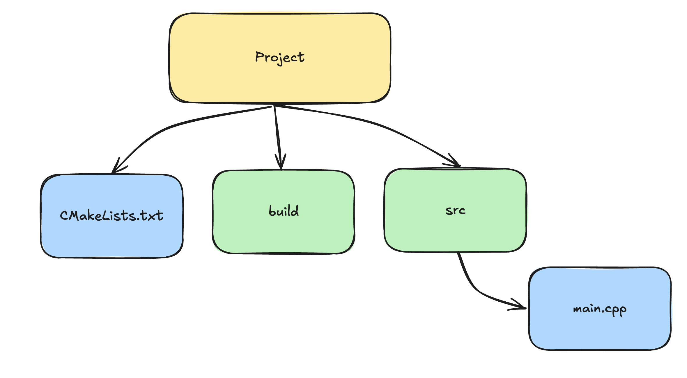

Структура проекта:

Пример main.cpp
```c++
#include <iostream>

int main(){
	std::cout << "Hello, world!" << std::endl;
	return 0;
}
```
Важно! Нет никаких зависимостей от библиотек, которые не встроенные в "язык".
Пример  CMakelists.txt
```python
cmake_minimum_required(VERSION 3.30)

project(example1)

set(SOURCES src/main.cpp)

add_executable(example1 ${SOURCES_FILES})
```
Он состоит из:
- [cmake_minimum_required](cmake_minimum_required.md)
- [project](project.md)
- [set](set.md)
- [add_executable](add_executable.md)
Теперь переходим в директорию build и вводим команды
```bash
cmake ..

make

./example1 #запуск исполняемого файлы
```
